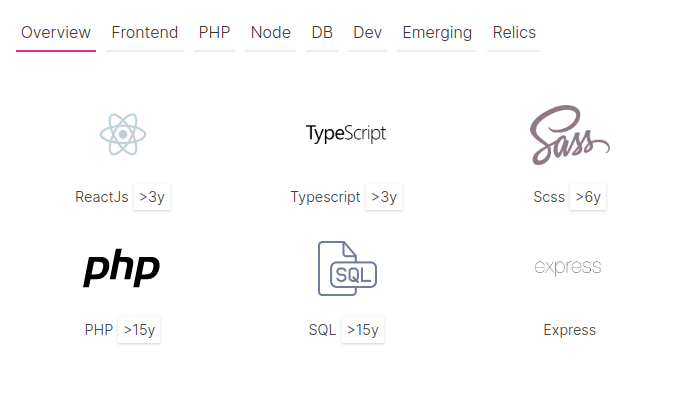

# profile-in-a-rush

**profile-in-a-rush** is a personal self-challenge hackaton to finally write a C.V. 

> **Disclaimer** I'm not really looking to improve it, though I would be 
> happy to see someone take it over, make something configurable and 
> share a more *polished* project. Forks welcome, but please don't use my
> texts, pictures... In other words clean up a bit. 
> 

### Why opensource ?

First of all it's more an experiment. I don't really like linked.in & consorts...
  
### What is interesting to look for ?

See the [skills components folder](./src/components/skills) it was really fun to write. 
It uses framer motion for animations. Spend almost a day to get what I wanted ;)
 
 
 
For a more traditional React example see the [github folder](./src/components/github), a react hooks api call
with some over-engineering.

Interested in Typescript example, see [error.ts](./src/core/result.ts).

Interested in configuring this website, see the [config folder](./config) 

### Wants to see the result ?

Go there: **[https://me.soluble.io](https://me.soluble.io)**. No tracking, no cookies.

### Some parts are hacky... 
 
... don't you fear it can have a negative effect ?

I'm fine with that  ;)  

### Why linked.in for contact ?

Yes I'm not so happy with this...  no time to make something really amazing for now.   

## The techs

## Aknowledgements

- Thanks Github !
- Design and information structure heavily inspired by [honeypot.io](https://honeypot.io). 
- FontAwesome for the beautifully crafted icons.
- SQL logo by [Yannick Lung](https://www.iconfinder.com/yanlu) found [here](https://www.iconfinder.com/icons/315017/document_file_sql_icon)   
